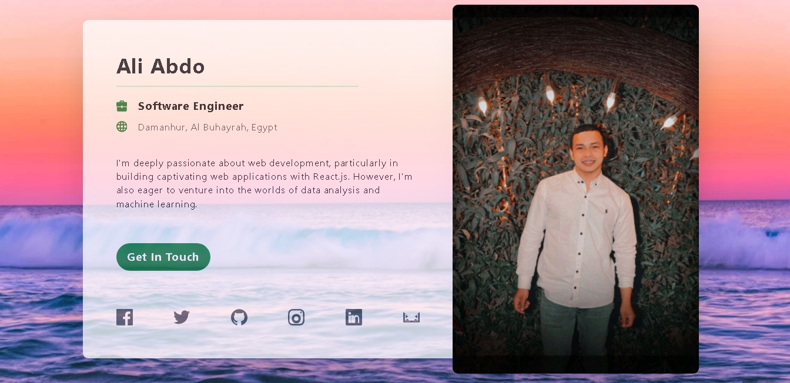

# Next.js Profile Card Template

This is a profile card template built using Next.js, React.js, and Tailwind CSS. It provides a simple and customizable layout for displaying user profiles with social media links.

## Features

- Responsive design
- Easily customizable
- Includes social media links

## Built With

- [Next.js](https://nextjs.org/) - The React framework for production
- [React.js](https://reactjs.org/) - A JavaScript library for building user interfaces
- [Tailwind CSS](https://tailwindcss.com/) - A utility-first CSS framework for quickly building custom designs

## Getting Started

To get a local copy up and running follow these simple steps.

### Prerequisites

Make sure you have Node.js and npm installed on your machine.

### Installation

1. Clone the repo
   ```sh
   git clone https://github.com/Aliabdo6/ui_profile_card
   ```
